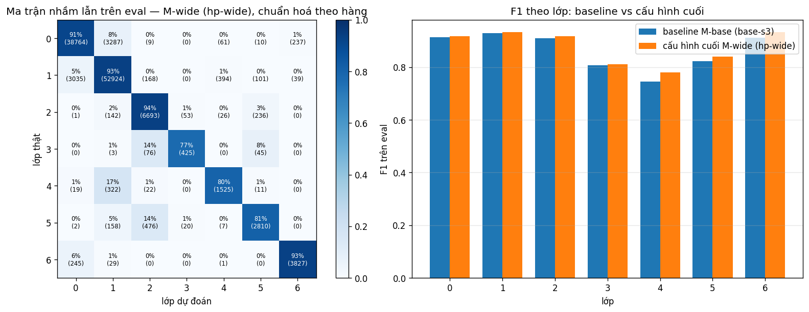

# Báo cáo Lab Day 1 — Nguyen Nhat Thang — 2A202602727

## 1. Thiết lập

- **Môi trường:** Google Colab. Part 0–3 chạy trên GPU Tesla T4, PyTorch 2.11.0 (CUDA 13.0). **Part 4 chạy trên CPU** vì Colab hết hạn mức GPU (xem mục 6).
- **Dữ liệu:** Forest CoverType; `train` 464 809 / `eval` 116 203 theo `split_metadata.csv`. Validation: 20% của train (phân tầng, seed 42) → 371 847 train / 92 962 val. Chuẩn hoá 10 cột số bằng mean/std của `X_tr`; 44 cột nhị phân giữ nguyên.
- **Model:** `M-base` (54→256→128→7, 47 879 tham số). **Baseline:** cross-entropy, SGD + momentum 0.9, **lr 0.3** (chọn bằng val), batch 512, 20 epoch, khởi tạo He, dropout 0, không clip, FP32.
- **Mốc tham chiếu:** accuracy "đoán lớp đa số" trên val = 0.4876 (macro-F1 ≈ 0.094).
- **Các chủ đề đã thử:** ☑ loss ☑ optimizer ☑ hyper-parameter ☑ dropout ☑ clipping ☑ mixed precision ☑ init (37 lần chạy, mỗi lần một dòng trong `experiments.xlsx`).

## 2. Kiểm tra ban đầu và độ nhiễu

| Kiểm tra | Kết quả |
|---|---|
| Số tham số / shape logits | 47 879 / (B, 7) (có `assert`) |
| Loss bước 0 trên val (ln 7 = 1.946) | 2.3776 (seed 42); 2.2691 / 1.9782 / 1.9005 ở seed 1 / 2 / 3 |
| Quá khớp 20 mẫu: loss cuối | 0.000306 sau 500 bước, accuracy 100% (`figures/part1_overfit20.png`) |
| Mọi tham số có gradient khác 0 | ☑ có (chuẩn từ 0.38 ở `b1` đến 2.37 ở `W2`) |
| Baseline, số seed đã chạy | 3 (`base-s1..s3`) |
| Baseline: val acc (TB ± σ) | 0.9120 ± 0.0010 |
| Baseline: val macro-F1 (TB ± σ) | 0.8580 ± 0.0037 |

**Ngưỡng nhiễu từ 3 seed:** 2σ = 0.0074 (val macro-F1). Loss bước 0 cao hơn ln 7 vì He có phương sai lớn nên logits ban đầu phân tán (std 0.65); độ lệch đổi theo seed nên không phải lỗi pipeline (xem `init-*` ở 3.7).

**Ngưỡng 2σ = 0.0074 có thể đánh giá thấp nhiễu thật.** Ở Part 4, 6 mô hình (3 baseline, 3 M-wide) được huấn luyện lại đúng cấu hình và seed nhưng trên CPU. Val macro-F1 lệch so với lần chạy GPU gốc từ 0.003 đến 0.012 (TB 0.007), lớn hơn σ = 0.0037. Gộp 6 lần chạy mỗi cấu hình, σ ≈ 0.0044 (baseline) và 0.0054 (M-wide), tức 2σ ≈ 0.009–0.011. Vì vậy mọi kết luận ở mục 3 có |ΔF1| trong khoảng 0.007–0.011 được coi là **chưa chắc**; chênh lệch ≥ 0.015 là đáng tin.

## 3. Kết quả theo chủ đề

Mọi so sánh dựa trên **val**, tại epoch có val loss thấp nhất; tham chiếu là `base-s1` (val macro-F1 0.8599). Mỗi thí nghiệm chỉ chạy 1 seed (seed 1) trừ khi ghi khác; "vượt nhiễu" nghĩa là |ΔF1| > 0.0074.

*Lưu ý khi đối chiếu với `experiments.xlsx`:* cột `delta_val_f1_vs_base` / `beyond_noise` của bảng so với **trung bình 3 seed baseline** (0.8580), còn báo cáo so với `base-s1` (0.8599), nên 3 dòng sát ngưỡng có kết luận khác nhau: `opt-adam-lr0.003` (+0.0081 so với trung bình → "Có" trong bảng; +0.0061 so với `base-s1` → "không" trong báo cáo), `final-wide-s3` (+0.0083 → "Có"; +0.0064 → "không") và `amp-bf16` (−0.0059 → "Không"; −0.0079 → "có"). Cả ba nằm trong vùng "chưa chắc" của mục 2, nên mình không kết luận chắc theo hướng nào.

### 3.1 Hàm mất mát — CE vs MSE
- **Dự đoán:** MSE hội tụ chậm hơn và macro-F1 thấp hơn vì gradient MSE (2(z − y)/(7B)) nhỏ hơn ~3.5 lần; tăng lr bù lại thì thu hẹp khoảng cách.
- **Kết quả:** `loss-mse-lr0.3`: 0.7649 (Δ = −0.095, vượt nhiễu), chỉ chạm val acc 0.88 ở epoch 20 (baseline: epoch 6). `loss-mse-lr1`: 0.5837 (Δ = −0.276), **không** thu hẹp khoảng cách mà tệ hơn. Ảnh: `figures/compare_loss.png`. MSE tính như `nn.MSELoss` (không hệ số 1/2, trung bình trên mọi phần tử B × 7); không so giá trị loss giữa hai loại.
- **Giải thích:** MSE kéo cả 7 logit về one-hot nên lr lớn khuếch đại luôn lực kéo các logit lớp sai, trong khi CE chỉ cần lớp đúng lớn hơn các lớp khác. Đây là giải thích hợp lý, chưa đo trực tiếp.

### 3.2 Bộ tối ưu hoá
- **Dự đoán:** SGD không momentum cần lr ≈ 10 lần (3.0) để bằng baseline; Adam hội tụ sớm hơn; AdamW ≈ Adam.
- **Ở lr tốt nhất của mỗi bộ** (mỗi bộ thử ≥ 2–5 lr; `compare_optimizer.png`, `compare_optimizer_val_loss.png`):

| Bộ | exp_id | lr | val macro-F1 | best epoch | ΔF1 | vượt nhiễu |
|---|---|---|---|---|---|---|
| SGD + momentum 0.9 | `lr-0.3` (= `base-s1`) | 0.3 | 0.8599 | 20 | 0 | – |
| SGD | `opt-sgd-lr1` | 1.0 | 0.8359 | 18 | −0.0240 | có |
| Adam (0.9, 0.999, 1e-8) | `opt-adam-lr0.003` | 0.003 | 0.8660 | 18 | +0.0061 | không |
| AdamW (wd 0.01) | `opt-adamw-lr0.003` | 0.003 | 0.8615 | 19 | +0.0016 | không |

- **Độ nhạy với lr:** SGD lr 3 rơi xuống 0.6725 (tệ hơn lr 1 rất nhiều); Adam lr 3e-4 chỉ 0.7874, lr 1e-3 0.8476. SGD+momentum ổn định trong 0.1–0.3, chậm ở lr ≤ 0.01.
- **Giải thích:** dự đoán "lr SGD tốt nhất ≈ 10 lần lr SGD+momentum" **sai** (tốt nhất ở 1.0, lr 3 hỏng): quy tắc 1/(1 − μ) chỉ đúng khi gradient giữ hướng qua nhiều bước; momentum còn trung bình hoá nhiễu giữa các lô. Adam/AdamW sau khi chỉnh lr chỉ **ngang** baseline đã chỉnh lr (trong nhiễu), không hơn; Adam đạt val acc 0.88 ở epoch 6, bằng baseline. Hạn chế: lr tốt nhất của Adam (0.003) nằm ở **biên trên** của lưới đã thử, nên chưa biết lr cao hơn có tốt hơn không.

### 3.3 Hyper-parameter
- **M-wide** (`hp-wide`, 54→512→256→7, 161 287 tham số): 0.8721 (**Δ = +0.0122, vượt nhiễu**), best val loss 0.1993 (thấp nhất toàn bộ), thời gian mỗi epoch không đổi (1.28 s so với 1.34 s) vì GPU chưa bão hoà. Tốt hơn dự đoán ("có thể trong nhiễu"). Baseline chưa quá khớp nên thêm năng lực giúp thật; gap val − train tăng nhẹ 0.0235 → 0.0317.
- **lr** (`hp-lr0.6`, `hp-lr1`): 0.8205 và 0.7804, đều kém lr 0.3 → lr 0.3 của Part 2 gần tối ưu, không nằm ở biên của một vùng còn tốt hơn (`compare_hparam_lr.png`).
- **Batch** (`compare_hparam_batch.png`, lr giữ 0.3): batch 128 có 58 120 bước (gấp 4 lần) nhưng **kém hơn** (0.8035, Δ = −0.056), mỗi epoch chậm 3.8 lần (5.06 s so với 1.34 s). Ngược dự đoán "nhiều bước hơn thì tốt hơn": lô nhỏ nhiễu hơn và lr 0.3 chọn cho batch 512 quá lớn với momentum 0.9. Batch 2048 (3 640 bước): 0.8420 (Δ = −0.018), nhanh gấp 4 lần (0.34 s/epoch).
- **Batch 2048 + lr 1.2** (quy tắc lr ×4, không warm-up; đổi 2 yếu tố, đã ghi trong `notes`): **sụp về đoán lớp đa số** (val acc 0.4876, macro-F1 0.0936), nặng hơn nhiều so với dự đoán "có thể dao động". Slide khuyên quy tắc này kèm warm-up; ở đây không có warm-up. Nguyên nhân cụ thể (ví dụ nơ-ron ReLU chết) chưa đo.

### 3.4 Dropout
- **Dự đoán:** baseline chưa quá khớp (gap val − train chỉ ≈ 0.024) nên dropout chỉ làm tệ hơn.
- **Kết quả:** `drop-0.1`: 0.8339 (Δ = −0.026); `drop-0.3`: 0.7820 (Δ = −0.078), cả hai vượt nhiễu (`compare_dropout.png`, `compare_dropout_train_loss.png`, train loss đo ở `eval()`). Gap val − train co lại: 0.0235 → 0.0128 → 0.0049.
- **Giải thích:** dropout chữa quá khớp; ở đây không có quá khớp để chữa, nó chỉ giảm năng lực hiệu dụng và thêm nhiễu gradient. Khớp dự đoán.

### 3.5 Gradient clipping
- **Chọn c từ `grad_norm`:** `grad_norm` trung bình của `base-s1` giảm 0.38 → 0.34 qua các epoch; chọn c = 0.35.
- **Ở lr bình thường (0.3):** `clip-0.35` kém baseline (0.8449, Δ = −0.015, vượt nhiễu), **khác dự đoán** "gần baseline". Tỉ lệ bước bị cắt là 80% ở epoch 1 và 44% ở epoch 20, vì c nằm ngay giữa vùng `grad_norm` bình thường nên clip can thiệp vào hầu hết các bước. Muốn clip chỉ chặn gai thì c phải đặt trên vùng bình thường (đề xuất, chưa chạy).
- **Phản chứng ở lr cao (3.0, ×10):** không clip, `grad_norm` max epoch 1 vọt lên **7 813** rồi mô hình sụp về đoán đa số (`clip-highlr3-noclip`: 0.0936). Cờ `diverged` không bật vì loss không thành NaN/inf: đây là kiểu hỏng cờ NaN không bắt được. Có clip (`clip-highlr3-c0.35`): 0.2577, cứu được một phần (bước bị chặn ở lr·c ≈ 1.05) nhưng vẫn rất kém baseline vì lr 3 vẫn quá lớn. Ảnh: `compare_clipping.png`, `compare_clipping_grad_norm.png`.

### 3.6 Mixed precision
- **Đo (T4, M-base, batch 512):**

| Chế độ | exp_id | s/epoch | bộ nhớ cực đại | val macro-F1 | ΔF1 |
|---|---|---|---|---|---|
| FP32 | `base-s1` | 1.34 | 167 MB | 0.8599 | 0 |
| FP16 + GradScaler | `amp-fp16` | 1.70 | 167 MB | 0.8577 | −0.0022 (trong nhiễu) |
| BF16 | `amp-bf16` | 1.51 | 167 MB | 0.8520 | −0.0078 (sát ngưỡng, chưa chắc) |

- **Giải thích:** M-base quá nhỏ (48k tham số) nên thời gian bị chi phối bởi gọi kernel và ép kiểu; autocast + GradScaler (scale, unscale, kiểm tra inf) làm FP16 **chậm hơn 27%** và bộ nhớ không giảm (tham số, optimizer ở FP32). FP16 cần nhân loss với s vì gradient nhỏ hơn ~6e-8 bị làm tròn về 0 (underflow); BF16 có cùng khoảng giá trị với FP32 nên thường không cần. `torch.cuda.is_bf16_supported()` trả `True` trên T4 và BF16 chạy được, **khác dự đoán** "BF16 có thể lỗi". T4 không có tensor core BF16, nên BF16 chậm hơn FP32 là hợp lý (suy luận, chưa đo). Ảnh: `compare_amp.png`.

### 3.7 Khởi tạo tham số
- **Dự đoán `zeros`:** mọi gradient của W bằng 0 (đối xứng, ReLU(0) = 0), chỉ bias lớp ra học → đoán lớp đa số.
- **Đo ở bước 0** (4 096 mẫu val; std kích hoạt sau ReLU h1, h2 và ở logits):

| init | std h1 | std h2 | std logits | loss bước 0 | val macro-F1 (`init-*`) |
|---|---|---|---|---|---|
| he (baseline) | 0.390 | 0.366 | 0.577 | 2.2691 | 0.8599 |
| zeros | 0 | 0 | 0 | 1.9459 | 0.0936 |
| normal (0.01) | 0.0203 | 0.0022 | 0.0003 | 1.9460 | 0.8558 |
| xavier (`xavier_normal_`, Var = 2/(n_vào + n_ra)) | 0.163 | 0.125 | 0.192 | 2.0222 | 0.8605 |
| default (`nn.Linear`) | 0.160 | 0.068 | 0.059 | 1.9830 | 0.8525 |

- **Giải thích:** `zeros` khớp dự đoán chính xác: sau một lần `backward()` chỉ bias lớp ra có gradient khác 0 (0.4967); loss bước 0 = ln 7 chính xác; kết quả đúng bằng mốc đoán đa số. `normal` co std ~10 lần mỗi lớp (logits ≈ 0.0003) nhưng mạng 3 lớp vẫn học được nên trong nhiễu; với 3 lớp chưa thấy hiện tượng tắt dần như biểu đồ "30 lớp ReLU". `xavier` và `default` trong nhiễu (`default`: −0.0074, đúng biên ngưỡng). He có loss bước 0 cao nhất vì logits phân tán nhất (xem mục 2). Ảnh: `compare_init.png`, `compare_init_f1.png`.

### 3.8 Cấu hình cuối cùng (chọn bằng val)
**M-wide** (54→512→256→7, lr 0.3, mọi thứ khác như baseline) là cấu hình **duy nhất** trong Part 3 tốt hơn baseline ngoài nhiễu; không kết hợp thêm kỹ thuật nào. Kiểm chứng 3 seed trên val (lần chạy GPU gốc, `compare_final.png`): M-wide 0.8686 ± 0.0031 so với baseline 0.8580 ± 0.0037 (Δ = +0.0106). Gộp thêm 3 lần chạy CPU của Part 4: 0.8720 ± 0.0054 so với 0.8582 ± 0.0044, Δ = +0.0138 (sai số chuẩn 0.0028, ≈ 4.9 lần). Seed M-wide kém nhất ở lần chạy GPU (0.8663) vẫn cao hơn seed baseline tốt nhất (0.8603).

## 4. Đánh giá cuối trên tập eval

Số lấy từ `eval_result.json` và `baseline_eval/eval_result_baseline.json` (do `scripts/evaluate.py` tạo, đã chạy lại và khớp). **Mô hình nộp = seed có val macro-F1 cao nhất của mỗi cấu hình, chọn bằng val (số lần chạy GPU gốc) trước khi nhìn eval.** Vì `best_state` không được lưu, cả hai mô hình được huấn luyện lại trên CPU với cùng cấu hình và seed; val macro-F1 của mô hình chạy lại ghi trong ngoặc.

| Cấu hình | Seed nộp | val macro-F1 (gốc GPU / chạy lại CPU) | **eval macro-F1** | eval accuracy |
|---|---|---|---|---|
| Baseline M-base (`base-s3`) | 3 | 0.8603 / 0.8566 | **0.8629** | 0.9155 |
| Cấu hình cuối M-wide (`hp-wide`) | 1 | 0.8721 / 0.8774 | **0.8761** | 0.9205 |

- **Cấu hình cuối:** M-wide, chọn bằng val như mục 3.8. File nộp `predictions_eval.csv` thuộc `hp-wide` (seed 1).
- **Cải thiện so với baseline có vượt nhiễu không?** Hai mô hình nộp: +0.0132 (0.8761 so với 0.8629). Cả 3 seed mỗi bên được chấm eval **chỉ để đo nhiễu** (không dùng để chọn gì): baseline 0.8635 ± 0.0064, M-wide 0.8769 ± 0.0071, Δ = **+0.0134** (sai số chuẩn 0.0055, ≈ 2.4 lần). Seed M-wide thấp nhất (0.8702) chỉ ngang seed baseline cao nhất (0.8701), tức hai nhóm gần như chạm nhau. Kết luận: M-wide **tốt hơn baseline với bằng chứng khá** (nhất quán giữa val 6 lần chạy và eval 3 seed), chưa phải bằng chứng mạnh về độ lớn: 3 seed là cỡ mẫu nhỏ và nhiễu mỗi lần chạy ≈ 0.005–0.007.
- **Val và eval:** gần nhau (hp-wide 0.8774 so với 0.8761; baseline 0.8566 so với 0.8629), chênh 0.001–0.006, cùng cỡ nhiễu giữa các lần chạy, nên không thấy dấu hiệu chọn cấu hình quá khít val.
- Lưu ý: seed nộp được chọn theo val gốc GPU nên `hp-wide` không phải seed có eval cao nhất (`final-wide-s2` đạt 0.8844); mình giữ nguyên lựa chọn đã chốt trước khi nhìn eval.

### 4.1 Phân tích lỗi theo lớp (M-wide `hp-wide`, từ `eval_result.json`)

| Lớp | support | precision | recall | F1 | F1 baseline |
|---|---|---|---|---|---|
| 0 | 42 368 | 0.9215 | 0.9149 | 0.9182 | 0.9140 |
| 1 | 56 661 | 0.9307 | 0.9340 | 0.9324 | 0.9295 |
| 2 | 7 151 | 0.8991 | 0.9360 | 0.9172 | 0.9089 |
| 3 | 549 | 0.8534 | 0.7741 | 0.8118 | 0.8074 |
| 4 | 1 899 | 0.7572 | 0.8031 | **0.7795** | 0.7460 |
| 5 | 3 473 | 0.8746 | 0.8091 | 0.8406 | 0.8220 |
| 6 | 4 102 | 0.9327 | 0.9330 | 0.9328 | 0.9124 |

- **Lớp khó nhất là lớp 4** (F1 = 0.7795; support 1 899, 1.6% eval). Nó bị nhầm chủ yếu với lớp 1: 17.0% mẫu thật của lớp 4 (322 mẫu) bị đoán là lớp 1, và 394 mẫu lớp 1 bị đoán là lớp 4 — 81% trong 489 dự đoán lớp 4 sai. Chỉ 0.7% mẫu lớp 1 bị nhầm như vậy, nhưng lớp 1 chiếm 48.8% eval nên đủ kéo precision lớp 4 xuống.
- **Số mẫu ít không đủ để giải thích:** lớp 3 có support nhỏ nhất (549) nhưng F1 (0.8118) cao hơn lớp 4. Lớp 3 có recall thấp nhất (0.7741), nhầm sang lớp 2 (76) và lớp 5 (45). Lớp 5 bị đoán thành lớp 2 ở 13.7% số mẫu.
- **Hai lớp lớn 0 và 1** nhầm nhau nhiều nhất về số lượng (3 287 và 3 035 mẫu) nhưng chỉ 7.8% và 5.4% mỗi lớp.
- **Giả thuyết (chưa kiểm chứng):** đặc trưng lớp 4 chồng lấn với lớp 1 nên khó tách biên. **Cách thử cải thiện:** cross-entropy có trọng số lớp hoặc lấy mẫu lại lớp 4, chọn bằng val macro-F1.
- M-wide tăng F1 ở cả 7 lớp so với baseline (+0.003 đến +0.034), nhiều nhất ở lớp 4, 6, 5. Hạn chế: chỉ so một mô hình mỗi bên, chưa đo nhiễu seed theo lớp.

## 5. Trả lời các câu hỏi dẫn dắt

1. **Bộ tối ưu nào "thắng" khi mỗi cái được chỉnh lr công bằng?** Không bộ nào thắng ngoài nhiễu: Adam (+0.0061) và AdamW (+0.0016) ngang SGD+momentum lr 0.3; SGD thuần kém −0.024 (`opt-*`, `lr-*`). **Khi lr không được chỉnh** kết luận đổi hoàn toàn: ở lr 0.3, Adam lr 3e-4 chỉ 0.7874 và SGD lr 0.3 chỉ 0.8090, nên dễ kết luận sai "SGD+momentum thắng" hay "Adam thua" chỉ vì lr.
2. **Dropout có giúp khi chưa quá khớp không?** Không: `drop-0.1` và `drop-0.3` đều kém (−0.026, −0.078) vì gap val − train của baseline chỉ ≈ 0.024. Nên dùng khi train loss thấp hơn val loss rõ rệt (quá khớp), ví dụ mô hình lớn hơn và huấn luyện lâu hơn.
3. **Clipping giải quyết vấn đề gì?** Chặn các bước cập nhật quá lớn do gradient đột biến. Quan sát: ở lr 3.0, `grad_norm` max đạt 7 813 ở epoch 1 và mô hình sụp (0.0936); có clip c = 0.35 cứu một phần (0.2577). Nhưng c quá gần vùng `grad_norm` bình thường làm hại ở lr thường (`clip-0.35`: −0.015).
4. **Mixed precision có nhanh hơn trên mạng này không?** Không: FP16 chậm hơn 27% (1.70 so với 1.34 s/epoch), BF16 chậm hơn 13% (1.51 s/epoch), bộ nhớ không đổi (167 MB). Mạng 48k tham số bị chi phối bởi gọi kernel và ép kiểu, không phải phép nhân ma trận.
5. **Vì sao khởi tạo toàn số 0 hỏng? He khác Xavier thế nào?** Khi W = 0, h = ReLU(0) = 0 nên gradient của mọi W bằng 0; mọi nơ-ron trong một lớp giống hệt nhau và không bao giờ khác đi, chỉ bias lớp ra học (đo được: 6 tham số, chỉ `net.4.bias` khác 0) → đoán lớp đa số. He dùng Var = 2/n_vào (bù cho ReLU triệt một nửa kích hoạt), Xavier dùng 2/(n_vào + n_ra) (không tính ReLU). Với mạng 3 lớp ở đây hai cách cho kết quả trong nhiễu (0.8599 so với 0.8605); sự khác biệt chỉ quan trọng khi mạng sâu hơn nhiều (chưa thử).
6. **Mạng có loss không giảm sau 2 000 bước, 3 phép kiểm tra đầu tiên:**
   - **Loss bước 0 ≈ ln 7 (1.946) và dữ liệu/nhãn đúng.** Loss bước 0 quá cao báo khởi tạo hoặc chuẩn hoá sai (ở đây He cho 2.3776 vẫn bình thường); `zeros` cho đúng 1.9459 và kẹt mãi ở đó.
   - **Quá khớp được một lô nhỏ (20 mẫu).** Nếu loss không xuống gần 0 gần như chắc chắn là lỗi code (nhãn, softmax hai lần, quên `zero_grad`, tham số chưa vào optimizer). Ở đây loss 2.264 → 0.0003, accuracy 100%.
   - **Mọi tham số có gradient khác 0 và `grad_norm` hợp lý.** `init-zeros` cho thấy gradient chết (chỉ 1/6 tham số có gradient); `clip-highlr3-noclip` cho thấy `grad_norm` max 7 813 dẫn tới sụp. Thêm: bảng "triệu chứng" gợi ý loss phẳng ≈ ln 7 thì kiểm tra lr (ở đây lr quá nhỏ 0.003 học rất chậm, 0.6657) và gradient chảy.

## 6. Hạn chế và điều bất ngờ

- **Kết quả khác dự đoán:** (a) MSE với lr lớn hơn tệ hơn thay vì tốt hơn (`loss-mse-lr1`); (b) SGD không momentum cần lr 1, không phải 3; (c) batch 128 kém hơn dù có 4 lần số bước; (d) batch 2048 + lr 1.2 sụp hẳn thay vì dao động; (e) `clip-0.35` làm hại ở lr thường vì cắt 44–80% số bước; (f) M-wide tốt hơn baseline ngoài nhiễu (dự đoán: trong nhiễu); (g) T4 chạy được BF16 (dự đoán: có thể lỗi). Ba lần chạy sụp về đoán lớp đa số (`init-zeros`, `clip-highlr3-noclip`, `hp-batch2048-lr1.2`) đều **không** bật cờ `diverged` vì loss không thành NaN/inf, nên chỉ phát hiện được qua val acc = 0.4876.
- **Độ nhiễu bị đánh giá thấp:** σ từ 3 seed GPU (0.0037) nhỏ hơn dao động thật giữa các lần chạy (≈ 0.005–0.006, đo được khi chạy lại trên CPU). Các kết luận có |ΔF1| trong 0.007–0.011 (ví dụ `amp-bf16` −0.0078, `init-default` −0.0074, `final-wide-s2` +0.0075) chưa chắc. Gần như mọi thí nghiệm ở Part 3 chỉ chạy 1 seed.
- **Phần cứng Part 4:** Part 4 chạy trên CPU nên mô hình dùng để chấm eval không trùng hoàn toàn với lần chạy GPU gốc. Điểm eval hợp lệ (do `evaluate.py` chấm chính file nộp), nhưng cột val trong `experiments.xlsx` của 6 dòng này là số gốc GPU (đã ghi vào `notes`).
- **Thiết kế:** lưới lr thô và có biên (lr 0.3 của SGD+momentum nằm ở biên lưới Part 2 dù `hp-lr0.6/1` đã kiểm tra thêm; lr 0.003 tốt nhất của Adam nằm ở biên trên lưới; AdamW chỉ thử 2 lr); cùng 20 epoch nhưng khác số bước khi đổi batch; một số thí nghiệm đổi 2 yếu tố (`loss-mse-lr1`, `opt-adamw-*`, `hp-batch2048-lr1.2`, đã ghi trong `notes`).
- **Nếu có thêm thời gian:** chạy ≥ 5 seed cho các so sánh gần ngưỡng; thử cross-entropy có trọng số lớp cho lớp 4; thử clip với c ≈ 1; thêm warm-up cho batch lớn; huấn luyện lâu hơn vì M-wide vẫn còn giảm ở epoch 20.

## 7. Phụ lục

- **Danh sách file nộp** (thư mục `submission_2A202602727/`): `REPORT.md`; `experiments.xlsx` (37 dòng, 4 sheet); `predictions_eval.csv` (của `hp-wide`, 116 203 dòng); `eval_result.json`; `figures/` (37 ảnh `<exp_id>.png`, 14 ảnh `compare_*.png`, `part1_overfit20.png`, `eval_confusion_and_per_class_f1.png`); `results/` (37 file JSON lịch sử); `baseline_eval/` (dự đoán và `eval_result_baseline.json` của baseline `base-s3`, không nộp chấm); `code/` (`lab.ipynb`, `data.py`, `model.py`, `train.py`, `optimizer.py`, `plots.py`, `results_table.py`).
- **Thời gian chạy ước tính:** tổng thời gian huấn luyện của 37 lần chạy trên T4 ≈ 17 phút (trung bình ≈ 28 s mỗi lần; dài nhất `hp-batch128` ≈ 101 s). Part 4 huấn luyện lại 6 mô hình trên CPU; thời gian chưa được ghi lại.
